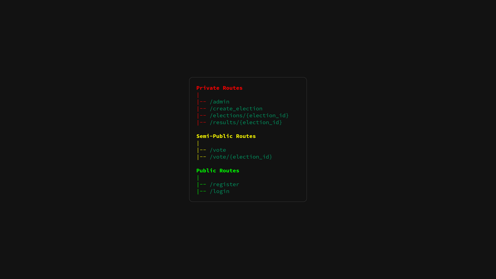
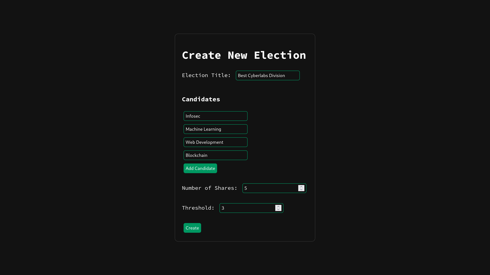
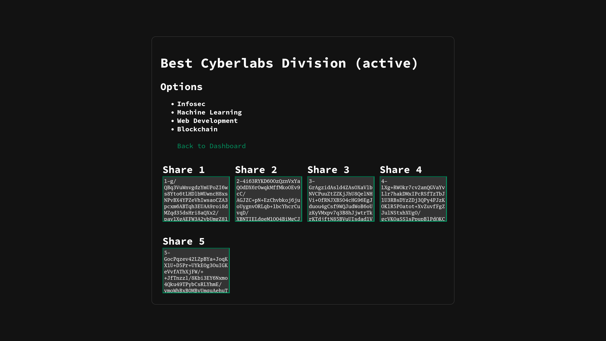
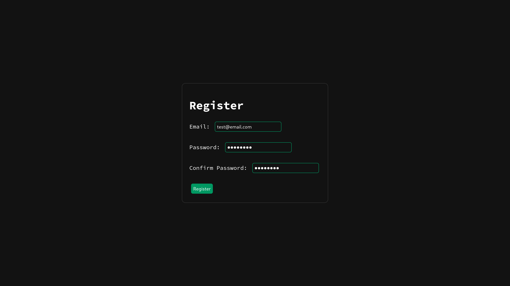
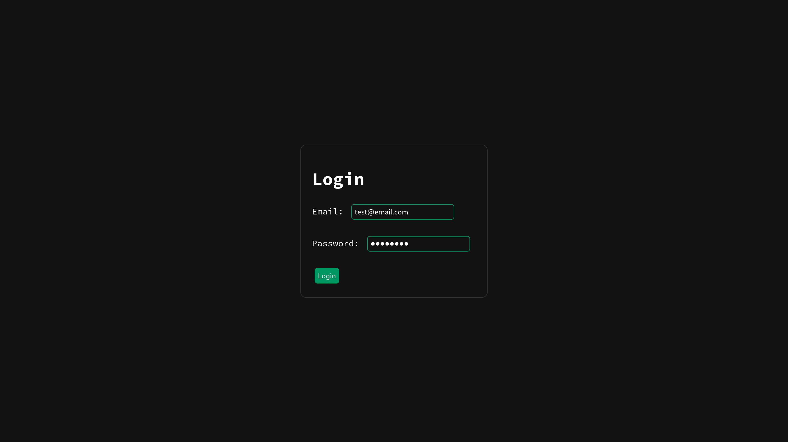
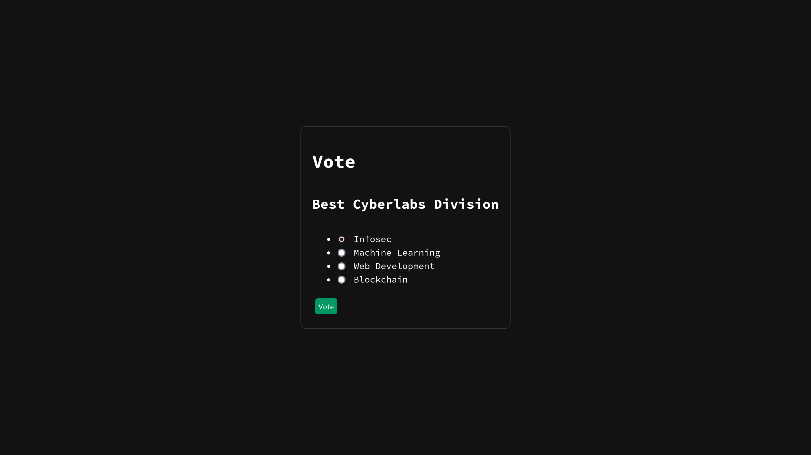
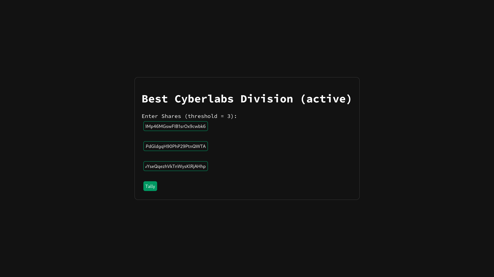
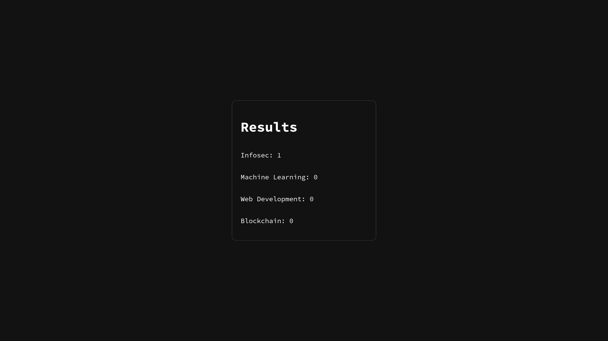

# Encrypted Ballot
Winter of Code 7.0 project for CyberLabs Infosec division IIT (ISM) Dhanbad.

# Screenshots

<table style="width:100%; text-align:center;">
  <tr>
    <th style="text-align:center;">Home</th>
    <th style="text-align:center;">Create Election</th>
  </tr>
  <tr>
    <td style="text-align:center;"></td>
    <td style="text-align:center;"></td>
  </tr>
  <tr>
    <th style="text-align:center;">Election</th>
    <th style="text-align:center;">Register</th>
  </tr>
  <tr>
    <td style="text-align:center;"></td>
    <td style="text-align:center;"></td>
  </tr>
  <tr>
    <th style="text-align:center;">Login</th>
    <th style="text-align:center;">Vote</th>
  </tr>
  <tr>
    <td style="text-align:center;"></td>
    <td style="text-align:center;"></td>
  </tr>
  <tr>
    <th style="text-align:center;">Tally</th>
    <th style="text-align:center;">Results</th>
  </tr>
  <tr>
    <td style="text-align:center;"></td>
    <td style="text-align:center;"></td>
  </tr>
</table>

# The Plan

